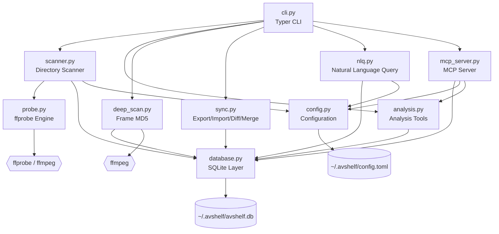

# AVShelf — Developer Guide

This document covers the internal architecture, module design, and data flow of AVShelf. For user-facing documentation, see [README.md](README.md).

## Project Structure

```
src/avshelf/
├── __init__.py        # Package metadata (__version__)
├── config.py          # Configuration management (TOML + env overrides)
├── database.py        # SQLite data layer (schema, CRUD, tags, categories, stats)
├── probe.py           # ffprobe integration (metadata extraction, hashing)
├── scanner.py         # Directory walker + incremental scan engine
├── analysis.py        # Analysis tools (dedup, similar, space, cold, boring, clean)
├── deep_scan.py       # Frame-level MD5 collection + decode verification
├── sync.py            # Multi-device sync (export, import, diff, merge)
├── nlq.py             # Natural language → structured query (LLM bridge)
├── mcp_server.py      # MCP server (FastMCP, 6 tools, stdio transport)
└── cli.py             # Typer CLI (25 commands, Rich output)
```

## Module Dependency Graph



## Layer Design

The architecture follows a **layered design** with clear separation of concerns:

```
┌─────────────────────────────────────────────────────┐
│                   Interface Layer                    │
│  ┌──────────┐  ┌──────────┐  ┌────────────────────┐ │
│  │  CLI     │  │  MCP     │  │  Natural Language  │ │
│  │ (Typer)  │  │ (FastMCP)│  │  Query (LLM)      │ │
│  └────┬─────┘  └────┬─────┘  └────────┬───────────┘ │
├───────┼──────────────┼─────────────────┼─────────────┤
│       │         Service Layer          │             │
│  ┌────┴─────┐  ┌──────────┐  ┌────────┴───────────┐ │
│  │ Scanner  │  │ Analysis │  │ Sync               │ │
│  │          │  │          │  │ (export/import/     │ │
│  │          │  │          │  │  diff/merge)        │ │
│  └────┬─────┘  └────┬─────┘  └────────┬───────────┘ │
│       │              │                 │             │
│  ┌────┴─────┐        │                 │             │
│  │ DeepScan │        │                 │             │
│  └────┬─────┘        │                 │             │
├───────┼──────────────┼─────────────────┼─────────────┤
│       │          Data Layer            │             │
│  ┌────┴──────────────┴─────────────────┴───────────┐ │
│  │              Database (SQLite)                   │ │
│  └─────────────────────┬───────────────────────────┘ │
│                        │                             │
│  ┌─────────────────────┴───────────────────────────┐ │
│  │         Probe (ffprobe / ffmpeg)                │ │
│  └─────────────────────────────────────────────────┘ │
├─────────────────────────────────────────────────────┤
│                 Infrastructure                       │
│  ┌──────────────┐  ┌──────────┐  ┌────────────────┐ │
│  │ Config       │  │ Trash    │  │ Logs           │ │
│  │ (TOML+env)   │  │ (recycle)│  │ (JSONL audit)  │ │
│  └──────────────┘  └──────────┘  └────────────────┘ │
└─────────────────────────────────────────────────────┘
```

## Module Details

### `config.py` — Configuration Management

- Loads settings from `~/.avshelf/config.toml` with fallback defaults
- Supports environment variable overrides (prefix `AVSHELF_`)
- Manages known media file extensions (video, audio, image, subtitle)
- Provides directory exclusion patterns for scanning
- Includes a minimal TOML serializer for writing config back to disk

### `database.py` — SQLite Data Layer

- Single-file SQLite database with WAL mode for concurrent reads
- Schema versioning for future migrations
- **Core tables:**
  - `media_files` — 45+ columns covering format, video, audio, color, HDR, track counts, hashes, and timestamps
  - `tags` / `media_tags` — Many-to-many tagging system
  - `categories` / `media_categories` — Many-to-many categorization
  - `directory_rules` — Auto-tagging rules per directory
  - `scan_history` — Audit trail of scan operations
  - `deep_scans` / `deep_scan_results` — Frame-level MD5 storage
- Soft-delete support (`deleted_at` column) — records are never hard-deleted until explicit purge
- Comprehensive indexing on frequently queried columns
- **Encapsulated query methods** — All data access from CLI and MCP goes through `Database` class methods (e.g., `get_media_type_stats()`, `get_codec_stats()`, `restore_media()`, `purge_media_by_path()`, `list_directory_rules()`, `get_total_size()`)

### `probe.py` — ffprobe Integration

- Runs `ffprobe -show_format -show_streams -show_chapters` with JSON output
- Extracts 45+ metadata fields from format, video, and audio streams
- **HDR detection:** Identifies HDR10, HLG, and Dolby Vision from color transfer characteristics and side data
- **Rotation extraction:** Reads from stream side_data or legacy tags
- **Media type classification:** Distinguishes video, audio, image (via container format + codec heuristics), and subtitle
- **Dual hashing:** Full SHA-256 content hash + fast head+tail sampling hash for quick dedup pre-screening

### `scanner.py` — Directory Scanner

- Recursive directory walker with configurable extension filtering
- **Incremental scanning:** Skips files with unchanged mtime + size (use `--full` to override)
- Graceful SIGINT handling — saves progress on Ctrl+C
- Rich progress bar with file-by-file status
- Automatic directory rule application after scan (auto-tags, auto-categories)
- Hash computation: fast hash for all files, full SHA-256 for files under 500MB

### `analysis.py` — Analysis Tools

- **Dedup:** Groups files by content hash (full or fast). Reports wasted bytes per group.
- **Similar:** Clusters video files by codec + resolution + similar duration/size (configurable tolerance).
- **Space:** Top-N largest files + per-directory size breakdown.
- **Cold:** Files not accessed in N days (atime-based; falls back to mtime when atime is unavailable, e.g. noatime mounts).
- **Boring:** H.264+AAC, ≤1080p, single audio, no subtitles/rotation/HDR/tags — candidates for archival.
- **Cleanup engine:** Generates JSON cleanup plans, executes by moving to `~/.avshelf/trash/` (never `rm`), with JSONL audit logging.

### `deep_scan.py` — Frame-level Verification

- Decodes first N frames via `ffmpeg -f framemd5` and stores per-frame MD5
- **Verification workflow:** Run baseline scan → upgrade ffmpeg → run new scan → compare frame-by-frame
- Detects decode regressions: mismatched frames, missing files, decode errors
- Supports custom decode parameters for testing specific decoder configurations

### `sync.py` — Multi-device Sync

- **Export:** Dumps all media records (with tags/categories) to a portable JSON file
- **Import:** Merges records by file hash first, then by path — no duplicates
- **Diff:** Compares two directories by filename or content hash
- **Merge:** Copies missing files from source to target with conflict resolution (skip / overwrite / keep-both)

### `nlq.py` — Natural Language Query

- Bridges natural language to structured SQL via LLM (OpenAI or Anthropic)
- System prompt defines all searchable fields and expected JSON output format
- Parses LLM response into SQL WHERE conditions and executes against the database
- Supports all search fields: codecs, resolution, HDR, rotation, interlacing, chapters, tags, categories, size, duration
- **Retry & error handling:** Automatic retries with exponential backoff for transient HTTP errors (429, 500, 502, 503, 529). Non-retryable errors (401, 403) fail immediately. Configurable timeout via `llm.timeout` (default 30s).

### `mcp_server.py` — MCP Server

Built with [FastMCP](https://github.com/jlowin/fastmcp), exposes 6 tools over stdio transport:

| Tool | Description |
|------|-------------|
| `search_media` | Search by any combination of 25+ filter parameters |
| `get_media_info` | Get complete metadata for a single file |
| `list_categories` | List all tags and categories with counts |
| `get_stats` | Database statistics (type distribution, codec distribution, total size) |
| `analyze_space` | Disk space analysis (top files, per-directory breakdown) |
| `get_deep_scan_results` | Retrieve frame-level MD5 results |

### `cli.py` — Command-Line Interface

- Built with [Typer](https://typer.tiangolo.com/) + [Rich](https://rich.readthedocs.io/)
- 25 commands organized into groups: scan, search, analysis, tags, deep-scan, sync, trash, stats, config
- Multiple output formats: Rich tables (default), JSON, CSV, path-only
- Human-readable size parsing (`100MB`, `1GB`) and formatting
- Lazy imports for fast startup — heavy modules loaded only when needed

## Data Flow

### Scan Pipeline

```
Directory
    │
    ▼
scanner.py ─── collect candidates (filter by extension + exclude patterns)
    │
    ▼
For each file:
    ├── Check mtime/size → skip if unchanged (incremental)
    ├── probe.py ─── run ffprobe → extract 45+ metadata fields
    ├── probe.py ─── compute fast_hash (head+tail) + file_hash (SHA-256)
    ├── database.py ─── upsert into media_files table
    └── Apply directory rules (auto-tags, auto-categories)
    │
    ▼
Record scan history
```

### Natural Language Query Pipeline

```
User question (e.g. "find HDR videos over 1GB")
    │
    ▼
nlq.py ─── Send to LLM with system prompt defining search schema
    │
    ▼
LLM returns structured JSON: {"has_hdr": true, "min_size_bytes": 1073741824}
    │
    ▼
nlq.py ─── Convert JSON to SQL WHERE conditions
    │
    ▼
database.py ─── Execute query against media_files
    │
    ▼
Return results to CLI / MCP
```

### MCP Request Pipeline

```
AI Assistant (Claude Desktop / Cursor / etc.)
    │
    ▼
MCP stdio transport
    │
    ▼
mcp_server.py ─── FastMCP dispatches to tool function
    │
    ├── search_media → database.query_media()
    ├── get_media_info → database.get_media_by_path()
    ├── list_categories → database queries tags/categories
    ├── get_stats → database.get_media_type_stats() + get_codec_stats() + get_total_size()
    ├── analyze_space → analysis.analyze_space()
    └── get_deep_scan_results → database queries deep_scans
```

## File System Layout

```
~/.avshelf/
├── config.toml              # User configuration
├── avshelf.db               # SQLite database (WAL mode)
├── trash/                   # Recoverable trash (organized by date)
│   ├── .avshelf_trash_meta.json   # Trash metadata (original paths, timestamps)
│   ├── 2025-01-15/          # Files trashed on this date
│   └── ...
└── logs/                    # Audit logs
    ├── 2025-01-15.jsonl     # Daily operation log
    └── ...
```

## Contributing

### Design Principles

1. **Data access through `Database` class** — CLI and MCP never execute raw SQL directly. All data access is encapsulated in `database.py` methods.
2. **Safe by default** — Cleanup never deletes files; everything goes through recoverable trash.
3. **Incremental first** — Scan operations skip unchanged files. Deep scans cache results.
4. **Lazy imports** — Heavy modules (analysis, deep_scan, nlq, mcp_server) are imported only when their commands are invoked, keeping CLI startup fast.

### Adding a New Command

1. Define the command function in `cli.py` using Typer decorators
2. Add any needed data access methods to `Database` class in `database.py`
3. If the command needs analysis logic, add it to `analysis.py`
4. Update README.md (user docs) and this file (developer docs) as needed

### Adding a New MCP Tool

1. Define the tool function in `mcp_server.py` using `@mcp.tool()` decorator
2. Reuse existing `Database` methods where possible — avoid raw SQL in MCP tools
3. Update the MCP tool table in this document and the MCP section in README.md
