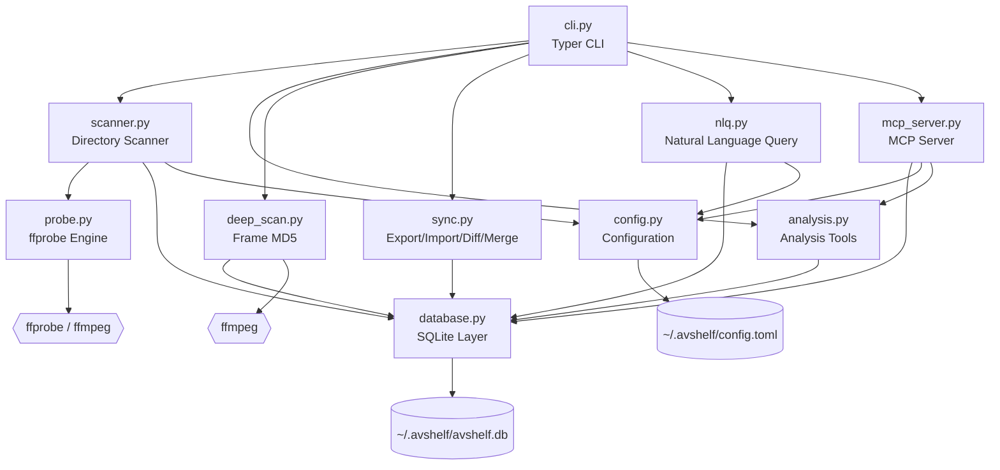

# AVShelf

A CLI-first media asset management tool powered by ffprobe. Scan, index, search, analyze, and manage your media files — all from the terminal.

## Features

- **Scan & Index** — Recursively scan directories, extract metadata via ffprobe, and store in a portable SQLite database. Incremental scanning skips unchanged files automatically.
- **Smart Search** — Query by codec, resolution, pixel format, HDR, rotation, interlacing, chapters, and dozens of other media attributes. Output as table, JSON, or CSV.
- **Natural Language Search** — Use LLM-powered queries (OpenAI / Anthropic) to find files without memorizing CLI flags.
- **Deep Scan & Verification** — Frame-level MD5 collection for decoder correctness verification. Compare two ffmpeg builds to detect decode regressions.
- **Dedup & Cleanup** — Find duplicate files (full hash or fast head+tail sampling), similar files, cold files, and "boring" files. Generate cleanup plans and safely move files to a recoverable trash.
- **Tags & Categories** — Organize files with user-defined tags and categories. Set up directory rules for automatic tagging on scan.
- **Multi-device Sync** — Export/import databases as JSON, diff and merge media directories across devices.
- **MCP Server** — Expose search and analysis capabilities to AI coding assistants via Model Context Protocol (stdio transport).
- **Safe by Design** — Cleanup never deletes files directly; everything goes through a recoverable trash with full audit logging.

## Requirements

- Python 3.10+
- ffprobe / ffmpeg (from [FFmpeg](https://ffmpeg.org/))

## Installation

```bash
# Create a virtual environment (recommended)
python3 -m venv .venv
source .venv/bin/activate

# Install in editable mode
pip install -e .
```

## Quick Start

```bash
# 1. Scan a directory to build the index
avshelf scan /path/to/media

# 2. Search for H.265 videos
avshelf search --vcodec hevc

# 3. Search with natural language (requires LLM config)
avshelf ask "find HDR videos with multiple audio tracks"

# 4. View detailed metadata for a file
avshelf info /path/to/file.mp4

# 5. Find duplicate files
avshelf dedup

# 6. Analyze disk space usage
avshelf space

# 7. Start MCP server for AI assistants
avshelf mcp
```

## CLI Reference

### Scanning & Indexing

| Command | Description |
|---------|-------------|
| `avshelf scan <dir>` | Scan a directory and index media files. Use `--full` to force re-scan, `--probe-all` to include unknown extensions. |
| `avshelf refresh` | Re-scan all previously indexed directories. Detects deleted/modified files. Use `--dir` to refresh a specific directory. |
| `avshelf purge` | Permanently remove all soft-deleted records from the database. |

### Search & Query

| Command | Description |
|---------|-------------|
| `avshelf search` | Search by codec, resolution, format, HDR, rotation, size, duration, tags, categories, and more. Supports `--output table/json/csv`, `--path-only`, `--count`. |
| `avshelf info <file>` | Show complete metadata for a single file, including raw ffprobe output. |
| `avshelf ask "<query>"` | Natural language search powered by LLM. Translates your question into structured filters automatically. |

**Search examples:**

```bash
# Find 4K HEVC videos with HDR
avshelf search --vcodec hevc --min-width 3840 --has-hdr

# Find files larger than 1GB, sorted by size
avshelf search --min-size 1GB --sort size

# Find interlaced content with subtitles
avshelf search --interlaced --has-subtitle

# Count all audio files
avshelf search --type audio --count

# Output file paths only (pipe-friendly)
avshelf search --vcodec av1 --path-only
```

### Analysis & Cleanup

| Command | Description |
|---------|-------------|
| `avshelf dedup` | Find duplicate files by content hash. Use `--fast` for head+tail sampling. |
| `avshelf similar` | Find similar files (same codec + resolution + similar duration/size). |
| `avshelf space` | Analyze disk space: top largest files and per-directory breakdown. |
| `avshelf cold` | Find files not modified in the last N days (default 180). |
| `avshelf boring` | Find unremarkable files (H.264+AAC, ≤1080p, single audio, no HDR/subtitles/tags). |
| `avshelf clean --plan <file>` | Execute a cleanup plan JSON — moves files to trash (never deletes directly). Supports `--dry-run`. |

### Tags, Categories & Rules

| Command | Description |
|---------|-------------|
| `avshelf tag add <file> <tags...>` | Add tags to a media file. |
| `avshelf tag remove <file> <tags...>` | Remove tags from a media file. |
| `avshelf tag list` | List all tags with usage counts. |
| `avshelf classify set <file> --category <name>` | Assign a category to a file. |
| `avshelf classify list` | List all categories with usage counts. |
| `avshelf rule add <dir> --tags <t1,t2> --category <c>` | Add auto-tagging rule for a directory. Applied on every scan. |
| `avshelf rule list` | List all directory rules. |

### Deep Scan & Verification

| Command | Description |
|---------|-------------|
| `avshelf deep-scan run <file>` | Decode first N frames and collect per-frame MD5. Use `--frames`, `--ffmpeg`, `--decode-params`. |
| `avshelf deep-scan list` | List all deep scan records. |
| `avshelf deep-scan show <file>` | Show frame-level MD5 results for a file. |
| `avshelf verify --baseline <id>` | Re-decode files and compare frame MD5s against a baseline scan. Detects decode regressions across ffmpeg versions. |

### Multi-device Sync

| Command | Description |
|---------|-------------|
| `avshelf export` | Export the media database to a JSON file. |
| `avshelf import <file>` | Import records from a JSON export. Merges by file hash — no duplicates. |
| `avshelf diff <dir_a> <dir_b>` | Compare two directories. Use `--by name` or `--by hash`. |
| `avshelf merge <source> <target>` | Copy missing files from source to target. Conflict resolution: `--on-conflict skip/overwrite/keep-both`. |

### Trash Management

| Command | Description |
|---------|-------------|
| `avshelf trash list` | List files currently in the trash. |
| `avshelf trash restore <path>` | Restore a file from trash to its original location. |
| `avshelf trash purge` | Permanently delete all files in the trash. |

### Other

| Command | Description |
|---------|-------------|
| `avshelf stats` | Database statistics: file counts by type, top codecs. |
| `avshelf config show` | Show current configuration. |
| `avshelf config set <key> <value>` | Set a configuration value (e.g. `llm.provider openai`). |
| `avshelf mcp` | Start the MCP server (stdio transport) for AI assistant integration. |

## Configuration

Configuration is stored in `~/.avshelf/config.toml`. Manage it via CLI or edit directly.

```bash
# Show all settings
avshelf config show

# Configure LLM for natural language search
avshelf config set llm.provider openai
avshelf config set llm.api_key sk-...
avshelf config set llm.model gpt-4o-mini

# Custom ffprobe/ffmpeg paths
avshelf config set scan.ffprobe_path /usr/local/bin/ffprobe
avshelf config set scan.ffmpeg_path /usr/local/bin/ffmpeg
```

**Environment variable overrides** (take precedence over config file):

| Variable | Config Key |
|----------|------------|
| `AVSHELF_LLM_API_KEY` | `llm.api_key` |
| `AVSHELF_LLM_PROVIDER` | `llm.provider` |
| `AVSHELF_LLM_MODEL` | `llm.model` |
| `AVSHELF_DB_PATH` | `database.path` |
| `AVSHELF_FFPROBE_PATH` | `scan.ffprobe_path` |
| `AVSHELF_FFMPEG_PATH` | `scan.ffmpeg_path` |

**Default config structure:**

```toml
[database]
path = "~/.avshelf/avshelf.db"

[scan]
hash_algorithm = "sha256"
ffprobe_path = "ffprobe"
ffmpeg_path = "ffmpeg"
exclude_patterns = [".git", ".svn", "__pycache__", "node_modules", ".DS_Store", ".avshelf"]

[scan.extensions]
video = [".mp4", ".mkv", ".avi", ".mov", ".ts", ".webm", ".h264", ".h265", ".hevc", ".vvc", ".av1", ...]
audio = [".mp3", ".aac", ".flac", ".wav", ".ogg", ".opus", ".m4a", ...]
image = [".jpg", ".png", ".webp", ".heic", ".avif", ".dpx", ".exr", ...]
subtitle = [".srt", ".ass", ".vtt", ".sub", ...]

[deep_scan]
default_frames = 10

[llm]
provider = ""
api_key = ""
model = ""
```

## Architecture

### Project Structure

```
src/avshelf/
├── __init__.py        # Package metadata (__version__)
├── config.py          # Configuration management (TOML + env overrides)
├── database.py        # SQLite data layer (schema, CRUD, tags, categories)
├── probe.py           # ffprobe integration (metadata extraction, hashing)
├── scanner.py         # Directory walker + incremental scan engine
├── analysis.py        # Analysis tools (dedup, similar, space, cold, boring, clean)
├── deep_scan.py       # Frame-level MD5 collection + decode verification
├── sync.py            # Multi-device sync (export, import, diff, merge)
├── nlq.py             # Natural language → structured query (LLM bridge)
├── mcp_server.py      # MCP server (FastMCP, 6 tools, stdio transport)
└── cli.py             # Typer CLI (25 commands, Rich output)
```

### Module Dependency Graph



### Layer Design

The architecture follows a **layered design** with clear separation of concerns:

```
┌─────────────────────────────────────────────────────┐
│                   Interface Layer                    │
│  ┌──────────┐  ┌──────────┐  ┌────────────────────┐ │
│  │  CLI     │  │  MCP     │  │  Natural Language  │ │
│  │ (Typer)  │  │ (FastMCP)│  │  Query (LLM)      │ │
│  └────┬─────┘  └────┬─────┘  └────────┬───────────┘ │
├───────┼──────────────┼─────────────────┼─────────────┤
│       │         Service Layer          │             │
│  ┌────┴─────┐  ┌──────────┐  ┌────────┴───────────┐ │
│  │ Scanner  │  │ Analysis │  │ Sync               │ │
│  │          │  │          │  │ (export/import/     │ │
│  │          │  │          │  │  diff/merge)        │ │
│  └────┬─────┘  └────┬─────┘  └────────┬───────────┘ │
│       │              │                 │             │
│  ┌────┴─────┐        │                 │             │
│  │ DeepScan │        │                 │             │
│  └────┬─────┘        │                 │             │
├───────┼──────────────┼─────────────────┼─────────────┤
│       │          Data Layer            │             │
│  ┌────┴──────────────┴─────────────────┴───────────┐ │
│  │              Database (SQLite)                   │ │
│  └─────────────────────┬───────────────────────────┘ │
│                        │                             │
│  ┌─────────────────────┴───────────────────────────┐ │
│  │         Probe (ffprobe / ffmpeg)                │ │
│  └─────────────────────────────────────────────────┘ │
├─────────────────────────────────────────────────────┤
│                 Infrastructure                       │
│  ┌──────────────┐  ┌──────────┐  ┌────────────────┐ │
│  │ Config       │  │ Trash    │  │ Logs           │ │
│  │ (TOML+env)   │  │ (recycle)│  │ (JSONL audit)  │ │
│  └──────────────┘  └──────────┘  └────────────────┘ │
└─────────────────────────────────────────────────────┘
```

### Module Details

#### `config.py` — Configuration Management

- Loads settings from `~/.avshelf/config.toml` with fallback defaults
- Supports environment variable overrides (prefix `AVSHELF_`)
- Manages known media file extensions (video, audio, image, subtitle)
- Provides directory exclusion patterns for scanning
- Includes a minimal TOML serializer for writing config back to disk

#### `database.py` — SQLite Data Layer

- Single-file SQLite database with WAL mode for concurrent reads
- Schema versioning for future migrations
- **Core tables:**
  - `media_files` — 45+ columns covering format, video, audio, color, HDR, track counts, hashes, and timestamps
  - `tags` / `media_tags` — Many-to-many tagging system
  - `categories` / `media_categories` — Many-to-many categorization
  - `directory_rules` — Auto-tagging rules per directory
  - `scan_history` — Audit trail of scan operations
  - `deep_scans` / `deep_scan_results` — Frame-level MD5 storage
- Soft-delete support (`deleted_at` column) — records are never hard-deleted until explicit purge
- Comprehensive indexing on frequently queried columns

#### `probe.py` — ffprobe Integration

- Runs `ffprobe -show_format -show_streams -show_chapters` with JSON output
- Extracts 45+ metadata fields from format, video, and audio streams
- **HDR detection:** Identifies HDR10, HLG, and Dolby Vision from color transfer characteristics and side data
- **Rotation extraction:** Reads from stream side_data or legacy tags
- **Media type classification:** Distinguishes video, audio, image (via container format + codec heuristics), and subtitle
- **Dual hashing:** Full SHA-256 content hash + fast head+tail sampling hash for quick dedup pre-screening

#### `scanner.py` — Directory Scanner

- Recursive directory walker with configurable extension filtering
- **Incremental scanning:** Skips files with unchanged mtime + size (use `--full` to override)
- Graceful SIGINT handling — saves progress on Ctrl+C
- Rich progress bar with file-by-file status
- Automatic directory rule application after scan (auto-tags, auto-categories)
- Hash computation: fast hash for all files, full SHA-256 for files under 500MB

#### `analysis.py` — Analysis Tools

- **Dedup:** Groups files by content hash (full or fast). Reports wasted bytes per group.
- **Similar:** Clusters video files by codec + resolution + similar duration/size (configurable tolerance).
- **Space:** Top-N largest files + per-directory size breakdown.
- **Cold:** Files not modified in N days.
- **Boring:** H.264+AAC, ≤1080p, single audio, no subtitles/rotation/HDR/tags — candidates for archival.
- **Cleanup engine:** Generates JSON cleanup plans, executes by moving to `~/.avshelf/trash/` (never `rm`), with JSONL audit logging.

#### `deep_scan.py` — Frame-level Verification

- Decodes first N frames via `ffmpeg -f framemd5` and stores per-frame MD5
- **Verification workflow:** Run baseline scan → upgrade ffmpeg → run new scan → compare frame-by-frame
- Detects decode regressions: mismatched frames, missing files, decode errors
- Supports custom decode parameters for testing specific decoder configurations

#### `sync.py` — Multi-device Sync

- **Export:** Dumps all media records (with tags/categories) to a portable JSON file
- **Import:** Merges records by file hash first, then by path — no duplicates
- **Diff:** Compares two directories by filename or content hash
- **Merge:** Copies missing files from source to target with conflict resolution (skip / overwrite / keep-both)

#### `nlq.py` — Natural Language Query

- Bridges natural language to structured SQL via LLM (OpenAI or Anthropic)
- System prompt defines all searchable fields and expected JSON output format
- Parses LLM response into SQL WHERE conditions and executes against the database
- Supports all search fields: codecs, resolution, HDR, rotation, interlacing, chapters, tags, categories, size, duration

#### `mcp_server.py` — MCP Server

Built with [FastMCP](https://github.com/jlowin/fastmcp), exposes 6 tools over stdio transport:

| Tool | Description |
|------|-------------|
| `search_media` | Search by any combination of 25+ filter parameters |
| `get_media_info` | Get complete metadata for a single file |
| `list_categories` | List all tags and categories with counts |
| `get_stats` | Database statistics (type distribution, codec distribution, total size) |
| `analyze_space` | Disk space analysis (top files, per-directory breakdown) |
| `get_deep_scan_results` | Retrieve frame-level MD5 results |

#### `cli.py` — Command-Line Interface

- Built with [Typer](https://typer.tiangolo.com/) + [Rich](https://rich.readthedocs.io/)
- 25 commands organized into groups: scan, search, analysis, tags, deep-scan, sync, trash, stats, config
- Multiple output formats: Rich tables (default), JSON, CSV, path-only
- Human-readable size parsing (`100MB`, `1GB`) and formatting
- Lazy imports for fast startup — heavy modules loaded only when needed

### Data Flow

#### Scan Pipeline

```
Directory
    │
    ▼
scanner.py ─── collect candidates (filter by extension + exclude patterns)
    │
    ▼
For each file:
    ├── Check mtime/size → skip if unchanged (incremental)
    ├── probe.py ─── run ffprobe → extract 45+ metadata fields
    ├── probe.py ─── compute fast_hash (head+tail) + file_hash (SHA-256)
    ├── database.py ─── upsert into media_files table
    └── Apply directory rules (auto-tags, auto-categories)
    │
    ▼
Record scan history
```

#### Natural Language Query Pipeline

```
User question (e.g. "find HDR videos over 1GB")
    │
    ▼
nlq.py ─── Send to LLM with system prompt defining search schema
    │
    ▼
LLM returns structured JSON: {"has_hdr": true, "min_size_bytes": 1073741824}
    │
    ▼
nlq.py ─── Convert JSON to SQL WHERE conditions
    │
    ▼
database.py ─── Execute query against media_files
    │
    ▼
Return results to CLI / MCP
```

### File System Layout

```
~/.avshelf/
├── config.toml              # User configuration
├── avshelf.db               # SQLite database (WAL mode)
├── trash/                   # Recoverable trash (organized by date)
│   ├── .avshelf_trash_meta.json   # Trash metadata (original paths, timestamps)
│   ├── 2025-01-15/          # Files trashed on this date
│   └── ...
└── logs/                    # Audit logs
    ├── 2025-01-15.jsonl     # Daily operation log
    └── ...
```

## License

MIT
